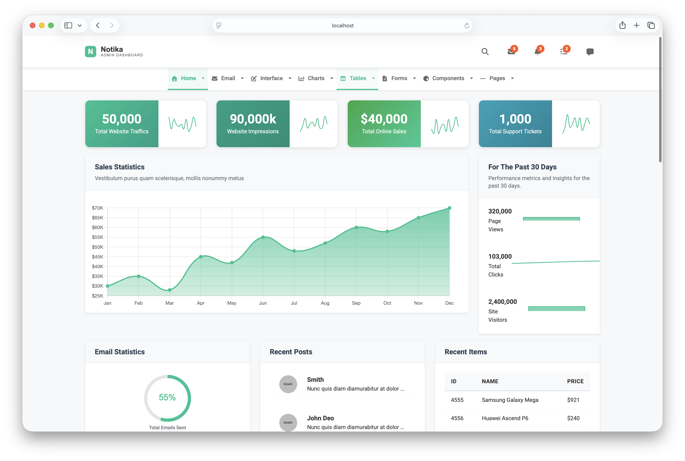
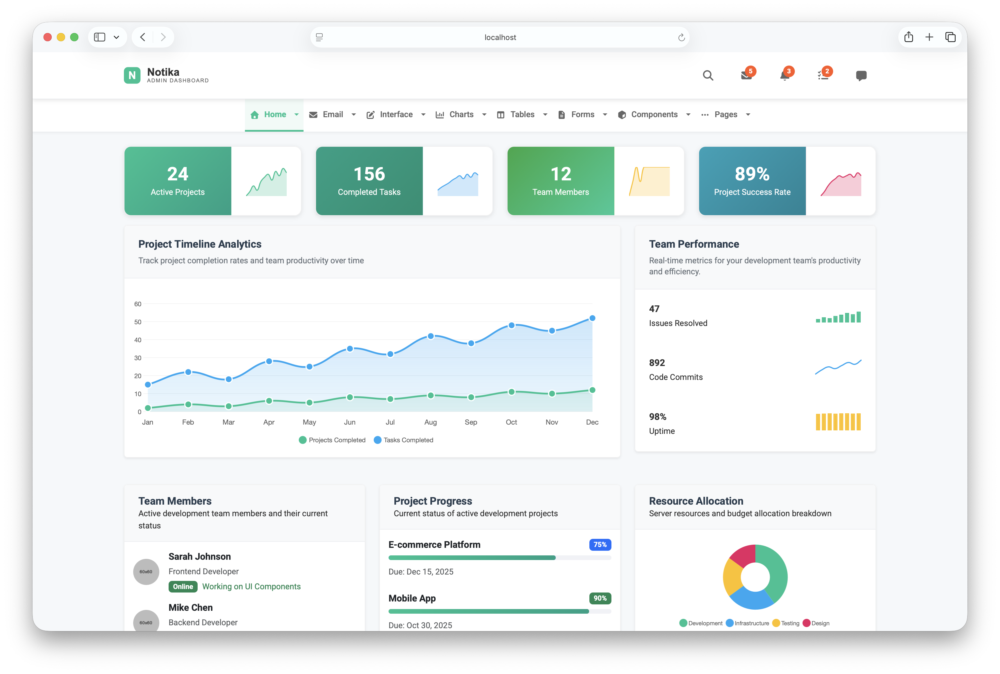

# Notika - Free Bootstrap Admin Dashboard Template

**Notika** is a green-themed, fully responsive Bootstrap 5 Admin Dashboard Template. Originally built with Bootstrap 3 and jQuery by [Colorlib](https://colorlib.com), it has been completely modernized to **Bootstrap 5.3.8** with **Vite 7.3** and **zero jQuery** — all interactivity is ES6 module JavaScript with tree-shaken Font Awesome icons.

Notika includes 41 ready-to-use pages covering dashboards, analytics, charts, forms, tables, email, UI components, and authentication screens. Uses a modern Vite build system with HMR, SCSS compilation, and optimized production bundles.

## Live Preview

### Screenshots





### Demo Site: [View Live Demo](https://colorlib.com/polygon/notika/index.html)

## Premium Admin Templates

Level up your next project with a premium dashboard. The templates below from [DashboardPack](https://dashboardpack.com/?utm_source=github&utm_medium=readme&utm_campaign=notika) include dedicated support, frequent updates, and battle-tested code.

<table>
  <tr>
    <td align="center" width="50%">
      <a href="https://dashboardpack.com/theme-details/tailpanel/?utm_source=github&utm_medium=readme&utm_campaign=notika">
        
      </a>
      <br>
      <a href="https://dashboardpack.com/theme-details/tailpanel/?utm_source=github&utm_medium=readme&utm_campaign=notika"><strong>TailPanel</strong></a>
      <br>
      <sub>React + TypeScript + Tailwind CSS + Vite. 9 dashboards, instant theme switching.</sub>
    </td>
    <td align="center" width="50%">
      <a href="https://dashboardpack.com/theme-details/admindek-html/?utm_source=github&utm_medium=readme&utm_campaign=notika">
        
      </a>
      <br>
      <a href="https://dashboardpack.com/theme-details/admindek-html/?utm_source=github&utm_medium=readme&utm_campaign=notika"><strong>Admindek</strong></a>
      <br>
      <sub>Bootstrap 5 + vanilla JS. 100+ components, dark/light toggle, RTL, color presets.</sub>
    </td>
  </tr>
  <tr>
    <td align="center" width="50%">
      <a href="https://dashboardpack.com/theme-details/adminty-html-dashboard/?utm_source=github&utm_medium=readme&utm_campaign=notika">
        
      </a>
      <br>
      <a href="https://dashboardpack.com/theme-details/adminty-html-dashboard/?utm_source=github&utm_medium=readme&utm_campaign=notika"><strong>Adminty</strong></a>
      <br>
      <sub>Bootstrap 5. 160+ screens for dashboards, e-commerce, CRM, and more.</sub>
    </td>
    <td align="center" width="50%">
      <a href="https://dashboardpack.com/theme-details/architectui-dashboard-html-pro/?utm_source=github&utm_medium=readme&utm_campaign=notika">
        
      </a>
      <br>
      <a href="https://dashboardpack.com/theme-details/architectui-dashboard-html-pro/?utm_source=github&utm_medium=readme&utm_campaign=notika"><strong>ArchitectUI</strong></a>
      <br>
      <sub>Bootstrap 5. 250+ reusable components, modular codebase, 9 dashboard configurations.</sub>
    </td>
  </tr>
  <tr>
    <td align="center" width="50%">
      <a href="https://dashboardpack.com/theme-details/kero-jquery-html-dashboard-pro/?utm_source=github&utm_medium=readme&utm_campaign=notika">
        
      </a>
      <br>
      <a href="https://dashboardpack.com/theme-details/kero-jquery-html-dashboard-pro/?utm_source=github&utm_medium=readme&utm_campaign=notika"><strong>Kero</strong></a>
      <br>
      <sub>Bootstrap 5 + Webpack. Horizontal and vertical nav modes, full SASS theming.</sub>
    </td>
    <td align="center" width="50%">
      <a href="https://dashboardpack.com/theme-details/cryptocurrency-dashboard/?utm_source=github&utm_medium=readme&utm_campaign=notika">
        
      </a>
      <br>
      <a href="https://dashboardpack.com/theme-details/cryptocurrency-dashboard/?utm_source=github&utm_medium=readme&utm_campaign=notika"><strong>Cryptocurrency Dashboard</strong></a>
      <br>
      <sub>Bootstrap. Tailored for Bitcoin, DeFi, and ICO management applications.</sub>
    </td>
  </tr>
</table>

<p align="center">
  <a href="https://dashboardpack.com/?utm_source=github&utm_medium=readme&utm_campaign=notika"><strong>Shop All Premium Templates</strong></a>
</p>

## Table of Contents

- [Features](#features)
- [Quick Start](#quick-start)
- [Pages](#pages-41)
- [Technology Stack](#technology-stack)
- [Project Structure](#project-structure)
- [Architecture](#architecture)
- [Adding New Pages](#adding-new-pages)
- [Browser Support](#browser-support)
- [More Resources](#more-resources)
- [Authors](#authors)
- [License](#license)

## Features

### Core Features

- **Vite 7.3 Build System**: HMR dev server, optimized production builds, code splitting
- **Bootstrap 5.3.8**: Latest CSS framework with JS bundle (includes Popper)
- **Zero jQuery**: All JavaScript is ES6 modules with class-based architecture
- **Tree-Shaken Icons**: Font Awesome 7.2 with only imported icons bundled
- **SCSS Support**: Modern Sass compilation with PostCSS autoprefixer and cssnano
- **Handlebars Partials**: Shared header, navbar, footer, and breadcrumb across all pages
- **Fully Responsive**: Horizontal navbar on desktop, offcanvas menu on mobile
- **Green Theme**: Primary accent `#00c292` with clean white card design

### Dashboard & Data Visualization

- **5 Dashboard Variants**: Main, secondary, social media analytics, project management, analytics
- **Chart.js 4.5**: Interactive charts (bar, line, area, doughnut, mixed, sparkline)
- **Leaflet Maps**: Interactive data and location maps
- **Widgets**: Counter animations with IntersectionObserver, real-time metric updates

### UI Components

- **Font Awesome 7.2**: Tree-shaken SVG icon system (solid + brand icons)
- **AOS**: Scroll-triggered entrance animations
- **Swiper 12**: Touch-enabled carousel slider
- **Bootstrap 5 Components**: Accordions, tabs, modals, dropdowns, popovers, tooltips, alerts

### Forms & Input

- **CodeMirror 6**: In-browser code editor with syntax highlighting and themes
- **Cropper.js 2**: Image cropping and manipulation
- **Native HTML5 Inputs**: Date, time, color, range pickers
- **Form Validation**: Bootstrap 5 validation patterns with custom styling

### Data & Layout

- **Data Tables**: Sortable, searchable tables with pagination
- **Email System**: Inbox, compose, and view email layouts
- **Invoice**: Printable invoice template
- **Contact**: Contact page with form and map integration

## Quick Start

```bash
git clone https://github.com/nicdev/notika.git
cd notika
npm install
npm run dev        # Dev server with HMR (port 3100)
```

Build for production:

```bash
npm run build      # Output to dist/
npm run preview    # Preview production build (port 4173)
```

## Pages (41)

All pages are live on the Colorlib demo server. Click any page name to preview.

| Category | Pages |
| --- | --- |
| **Dashboards** | [Main Dashboard](https://colorlib.com/polygon/notika/index.html), [Dashboard 2](https://colorlib.com/polygon/notika/index-2.html), [Social Media](https://colorlib.com/polygon/notika/index-3.html), [Projects](https://colorlib.com/polygon/notika/index-4.html), [Analytics](https://colorlib.com/polygon/notika/analytics.html) |
| **Email** | [Inbox](https://colorlib.com/polygon/notika/inbox.html), [Compose](https://colorlib.com/polygon/notika/compose-email.html), [View Email](https://colorlib.com/polygon/notika/view-email.html) |
| **Charts** | [Bar Charts](https://colorlib.com/polygon/notika/bar-charts.html), [Line Charts](https://colorlib.com/polygon/notika/line-charts.html), [Area Charts](https://colorlib.com/polygon/notika/area-charts.html), [Flot Charts](https://colorlib.com/polygon/notika/flot-charts.html) |
| **Forms** | [Form Elements](https://colorlib.com/polygon/notika/form-elements.html), [Form Components](https://colorlib.com/polygon/notika/form-components.html), [Form Examples](https://colorlib.com/polygon/notika/form-examples.html) |
| **Tables** | [Data Table](https://colorlib.com/polygon/notika/data-table.html), [Normal Table](https://colorlib.com/polygon/notika/normal-table.html) |
| **Components** | [Tabs](https://colorlib.com/polygon/notika/tabs.html), [Accordion](https://colorlib.com/polygon/notika/accordion.html), [Alert](https://colorlib.com/polygon/notika/alert.html), [Buttons](https://colorlib.com/polygon/notika/buttons.html), [Modals](https://colorlib.com/polygon/notika/modals.html), [Notification](https://colorlib.com/polygon/notika/notification.html), [Dialog](https://colorlib.com/polygon/notika/dialog.html), [Dropdown](https://colorlib.com/polygon/notika/dropdown.html), [Popovers](https://colorlib.com/polygon/notika/popovers.html), [Tooltips](https://colorlib.com/polygon/notika/tooltips.html) |
| **Interface** | [Animations](https://colorlib.com/polygon/notika/animations.html), [Google Map](https://colorlib.com/polygon/notika/google-map.html), [Data Map](https://colorlib.com/polygon/notika/data-map.html), [Code Editor](https://colorlib.com/polygon/notika/code-editor.html), [Image Cropper](https://colorlib.com/polygon/notika/image-cropper.html), [Wizard](https://colorlib.com/polygon/notika/wizard.html) |
| **Miscellaneous** | [Contact](https://colorlib.com/polygon/notika/contact.html), [Invoice](https://colorlib.com/polygon/notika/invoice.html), [Typography](https://colorlib.com/polygon/notika/typography.html), [Color](https://colorlib.com/polygon/notika/color.html), [Widgets](https://colorlib.com/polygon/notika/widgets.html) |
| **Auth** | [Login / Register](https://colorlib.com/polygon/notika/login-register.html), [404](https://colorlib.com/polygon/notika/404.html) |

## Technology Stack

All libraries are bundled via Vite from npm packages — no CDN links, no local vendor files.

| Library | Version | Purpose |
| --- | --- | --- |
| Vite | 7.3.1 | Build system with HMR, code splitting, SCSS |
| Bootstrap | 5.3.8 | CSS framework + JS bundle (includes Popper) |
| Chart.js | 4.5.1 | Dashboard and page charts |
| Font Awesome | 7.2.0 | Tree-shaken SVG icon system |
| Swiper | 12.1.0 | Carousel slider |
| Leaflet | 1.9.4 | Interactive maps |
| AOS | 2.3.4 | Scroll animations |
| Day.js | 1.11.19 | Date formatting and manipulation |
| CodeMirror | 6.x | In-browser code editor |
| Cropper.js | 2.1.0 | Image cropping |
| Sass | 1.97.3 | SCSS compilation |
| PostCSS | 8.5.6 | Autoprefixer + cssnano minification |

## Project Structure

```text
notika/
  vite.config.js          Vite build config (multi-page, Handlebars, manual chunks)
  package.json            Dependencies and scripts
  notika/green-horizotal/
    src/
      js/
        main.js           NotikaApp class — imports all CSS, main entry point
        modules/
          charts.js       NotikaCharts (Chart.js wrapper with instance Map)
          ui.js           NotikaUI (Bootstrap components, counter animations)
        pages/            31 page-specific ES6 modules extending NotikaApp
      css/
        modern.scss       Modern SCSS styles and custom properties
        dashboard-widgets.css  Dashboard widget layout styles
      partials/           Handlebars partials (header.hbs, navbar.hbs, footer.hbs, breadcrumb.hbs)
    css/
      header-modern-clean.css  Header styles
      navbar-stable.css        Horizontal navigation
      mobile-menu.css          Offcanvas mobile menu
      responsive.css           Responsive breakpoints
      widgets-consistent.css   Widget spacing consistency
      email-widget-fix.css     Email page widget fix
    style.css             Main theme — Bootstrap 5 overrides, component styles
    *.html                41 template pages
    img/                  Images (Vite publicDir)
```

## Architecture

- **Vite-Bundled** — all CSS and JS imported through `main.js`, tree-shaken and code-split by Vite
- **No jQuery** — all interactivity is ES6 classes in `main.js` with page-specific modules
- **Class Inheritance** — `NotikaApp` base class handles shared init; page modules extend it with `class MyPage extends NotikaApp`
- **Handlebars Partials** — header, navbar, footer, and breadcrumb are shared `.hbs` templates with dynamic context (page title, nav active state, year)
- **Font Awesome Tree-Shaking** — icons explicitly imported and added to `library.add()`, only used icons bundled
- **Manual Chunks** — Vite splits vendor (Bootstrap), charts (Chart.js), and UI (Swiper, AOS) into separate cacheable chunks
- **CSS Architecture** — Bootstrap loaded via Vite, template CSS imported in order, modern SCSS compiled with `api: 'modern-compiler'`
- **Horizontal Navigation** — desktop dropdown navbar (>=992px) with Bootstrap 5 offcanvas mobile menu (<992px)
- **Green Theme** — primary `#00c292`, card shadows `0 2px 8px rgba(0,0,0,0.1)`, CSS custom properties for spacing

## Adding New Pages

1. Create `newpage.html` in `notika/green-horizotal/`
2. Add entry to `vite.config.js` > `rollupOptions.input`
3. For custom logic: set `<html data-page-module="newpage">`, create `src/js/pages/newpage.js` extending `NotikaApp`

### Adding Font Awesome Icons

Icons are tree-shaken. Import and register in `main.js`:

```javascript
import { faNewIcon } from '@fortawesome/free-solid-svg-icons'
library.add(faNewIcon)
```

## Browser Support

Notika supports all modern browsers:

- Chrome >= 90
- Firefox >= 88
- Safari >= 14
- Edge >= 90
- Opera >= 76

**Note**: Internet Explorer is not supported.

## More Resources

- [Bootstrap Admin Dashboards](https://colorlib.com/wp/free-bootstrap-admin-dashboard-templates/) - Collection of Bootstrap admin templates
- [Angular Dashboards](https://colorlib.com/wp/angularjs-admin-templates/) - Angular-based admin templates
- [Free Admin Dashboards](https://colorlib.com/wp/free-html5-admin-dashboard-templates/) - Free HTML5 admin templates
- [Website Templates](https://colorlib.com/wp/templates/) - Various website templates
- [WordPress Themes](https://colorlib.com/wp/free-wordpress-themes/) - Free WordPress themes

## Authors

Created and maintained by [Colorlib](https://colorlib.com)

## License

Notika is licensed under The MIT License (MIT). You may use, copy, modify, merge, publish, distribute, sublicense, and/or sell copies of the final products. Attribution to [Colorlib](https://colorlib.com) as the original author is required.
